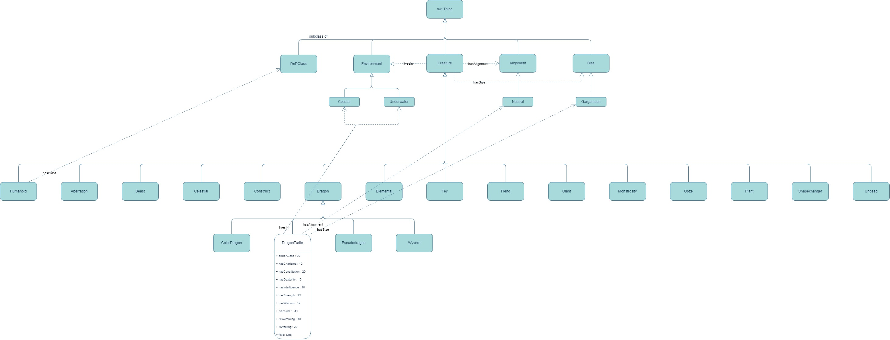

# DnD-Bestiary-ontology
ASsignment from Ontology and Knowledge Engineering, 2024

## About ontology
Our ontology contains basic information about beasts in the DnD setting. We built the ontology as an assignemnt goal of learning how ontologies work and how to design and build ontologies.

We used stats available for monsters from Basic Rules listed on [Monsters for D&D 5e - DnD Beyond](https://www.dndbeyond.com/monsters?filter-type=0&filter-search=&filter-cr-min=&filter-cr-max=&filter-armor-class-min=&filter-armor-class-max=&filter-average-hp-min=&filter-average-hp-max=&filter-is-legendary=&filter-is-mythic=&filter-has-lair=&filter-source=1&filter-partnered-content=f).

## Class description
Our ontology contains 5 top-level classes, 3 object properties and 13 data properties. Diagram below shows the basic schema of our ontology with an example for DragonTurtle. Complete schema is available [here](diagramme-p1.jpg)

### Class Creature
Class Creature is the base class, containing subclasses for monster types. The monsters themselves are under the respective types. For example, monster DragonTurtle is of type Dragon, which is Creature.

### Classes Alignment, Size & Environment
These classes are located on the same level as class Creature. We have defined relationships as triples `(Creature hasAlignment Alignment)`, `(Creature hasSize Size)`, and `(Creature livesIn Environment)`. For our example of DragonTurtle, We have following information: DragonTurtle has neutral alignment, is of size Gargantuan and lives in either Coastal or Underwater.

### Data properties Speed, Stats, HP & Armor
Each monster has basic statistics, like speed (eg walking, swimming), stats (eg Char, Int), hitpoints and armor class. These are defined as data properties - they hold integer values rather than being a subclass. For our DragonTurtle, here's an example of the data we know: 341HP, Strength 25, swim speed 40ft. 

## Contributors
- [@Pia669](https://github.com/Pia669)
  - Dragon, Elemental, Fey, Fiend and Giant - subclasses and their properties
  - Implemented Shapechanger and Humanoid subclasses (with [@Louksi](https://github.com/Louksi))
- [@Louksi](https://github.com/Louksi)
  - Humanoid, Monstrosity, Ooze, Plant and Undead - subclasses and their properties
  - Implemented Shapechanger and Humanoid subclasses (with [@Pia669](https://github.com/Pia669))
  - Diagrams of ontology
- [@frantiiisek](https://github.com/frantiiisek)
  - Abberation, Beast, Celestial and Construct - subclasses and their properties
  - Documentation

If you want to contribute, you can create an issue or a pull request
